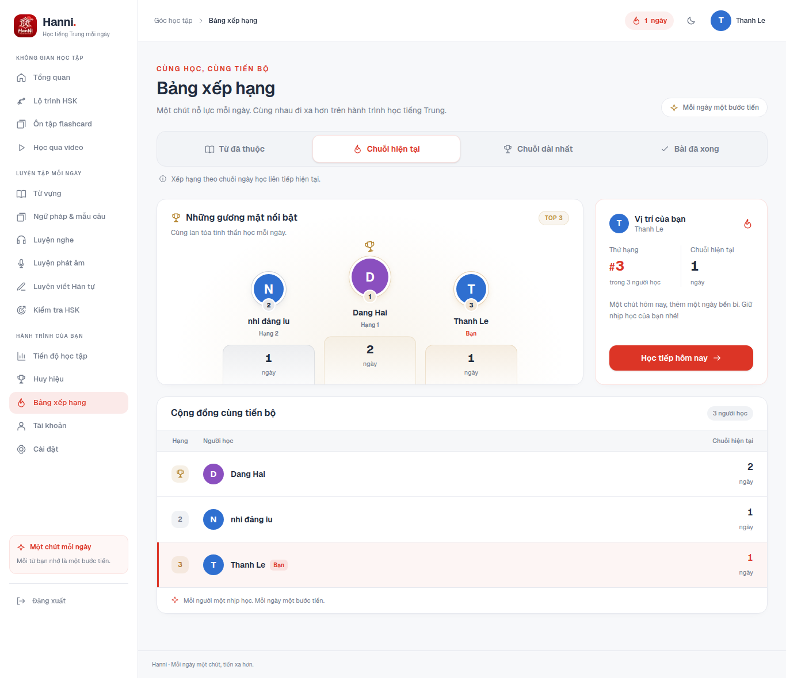
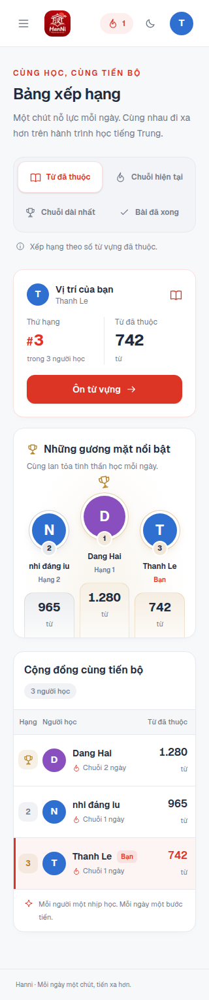
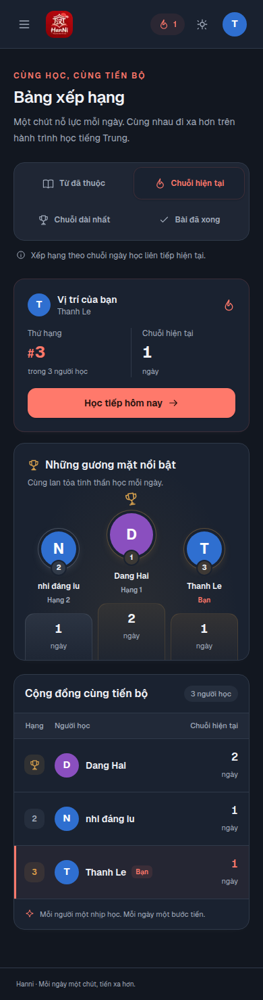

# Giao diện bảng xếp hạng

Cập nhật ngày 12/09/2026 cho `/leaderboard`. Bố cục cũ có thẻ hạng cá nhân trải dài và danh sách thiếu điểm nhấn. Bản mới đưa các vị trí dẫn đầu vào bục top 3, đặt thẻ cá nhân cạnh bên trên laptop và đưa vị trí của bạn lên trước trên mobile.

## Nguồn tham khảo

- [Trophy UI — Leaderboard Podium](https://ui.trophy.so/docs/components/leaderboard-podium): tham khảo cách đặt hạng nhất ở giữa, làm nổi bật avatar và kết hợp bục dẫn đầu với danh sách.
- [Trophy UI — Leaderboard Rankings](https://ui.trophy.so/docs/components/leaderboard-rankings): tham khảo cách trình bày hạng, người học, thành tích và đánh dấu người dùng hiện tại.
- [W3C APG — Tabs Pattern](https://www.w3.org/WAI/ARIA/apg/patterns/tabs/): phím mũi tên/Home/End di chuyển focus; Enter/Space chọn tiêu chí. Không tự tải tiêu chí mới chỉ vì người dùng di chuyển focus.

Giao diện được viết bằng các component, icon và token màu của Hanni; không thêm thư viện UI hoặc tải ảnh từ các mẫu tham khảo.

## Thay đổi

- Bốn tiêu chí thành bộ nút có icon, bố cục 2 × 2 trên điện thoại, một hàng từ 640px. Vùng bấm cao tối thiểu 48px, có trạng thái chọn và focus.
- Top 3 có màu huy chương nhẹ, avatar hạng nhất lớn hơn. Chỉ hiển thị người học có thật trong dữ liệu; xử lý cả khi chỉ có một hoặc hai người.
- Thẻ cá nhân hiển thị hạng, tổng người được xếp hạng, thành tích và nút tiếp tục học phù hợp với tiêu chí. Người chưa có hạng vẫn thấy trạng thái rõ ràng.
- Bảng có tiêu đề cột, số liệu căn phải và dòng của bạn được nhấn bằng màu nền, vạch bên trái cùng nhãn “Bạn”. Không lặp lại chuỗi ngày ở cột tên khi đang xếp theo chuỗi hiện tại.
- Tên dài xuống dòng trong bảng, tối đa hai dòng trên bục; số lớn có thể ngắt dòng. Nếu API chỉ trả nhóm dẫn đầu, nhãn và ghi chú không coi đó là toàn bộ cộng đồng.
- Skeleton theo bố cục responsive; bảng trống có lối vào học; lỗi tải có nút thử lại. Lỗi cập nhật nền vẫn giữ dữ liệu đã tải kèm thông báo.
- Màu sáng/tối dùng token hiện có. Skeleton tôn trọng lựa chọn giảm chuyển động.

## Mã nguồn

- `app/(app)/leaderboard/page.tsx`: xác thực, SWR, chọn tiêu chí, bàn phím và các trạng thái tải.
- `components/leaderboard.tsx`: cấu hình tiêu chí, top 3, vị trí cá nhân, bảng và skeleton.
- `components/leaderboard.module.css`: kiểu dáng riêng cho bục, huy chương và bảng.

Giữ `useRequireAuth()`, `useLeaderboard()` và `useLeaderboardMetrics()` hiện có. Hạng và thành tích lấy từ API; không tự tính lại thứ hạng trên client.

## Kiểm tra

- `npm run build`: thành công, bao gồm TypeScript và tạo route production.
- `npm run lint`: không lỗi; còn 5 cảnh báo có sẵn ở các file ngoài phạm vi thay đổi. Lint riêng hai file TSX bảng xếp hạng không có cảnh báo.
- `git diff --check`: đạt.
- Chrome/Playwright: 320, 390, 768, 1024, 1366 và 1440px, đủ bốn tiêu chí; không tràn ngang hoặc lỗi JavaScript. Kiểm tra thêm giao diện sáng/tối, tên dài, một/hai người học, chưa xếp hạng, dữ liệu trống, lỗi và thử lại, skeleton và điều khiển bàn phím.

Kiểm tra giao diện dùng API fixtures trong browser context riêng để tái hiện các trạng thái; không sửa xác thực ứng dụng hoặc dữ liệu backend. Các ảnh dưới đây dùng **dữ liệu kiểm thử**, không phải số liệu tài khoản thật. Chưa xác nhận luồng với phiên đăng nhập backend thật trong lần thay đổi này.

## Ảnh xem trước

Laptop 1366px:

Mobile 320px:

Mobile 390px, chế độ tối:

