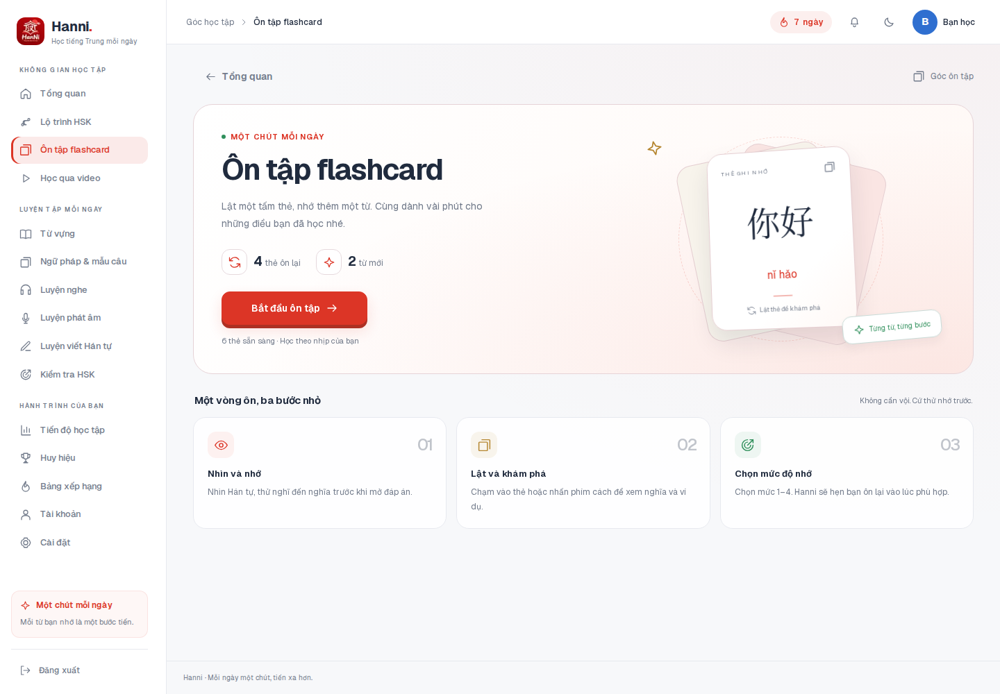
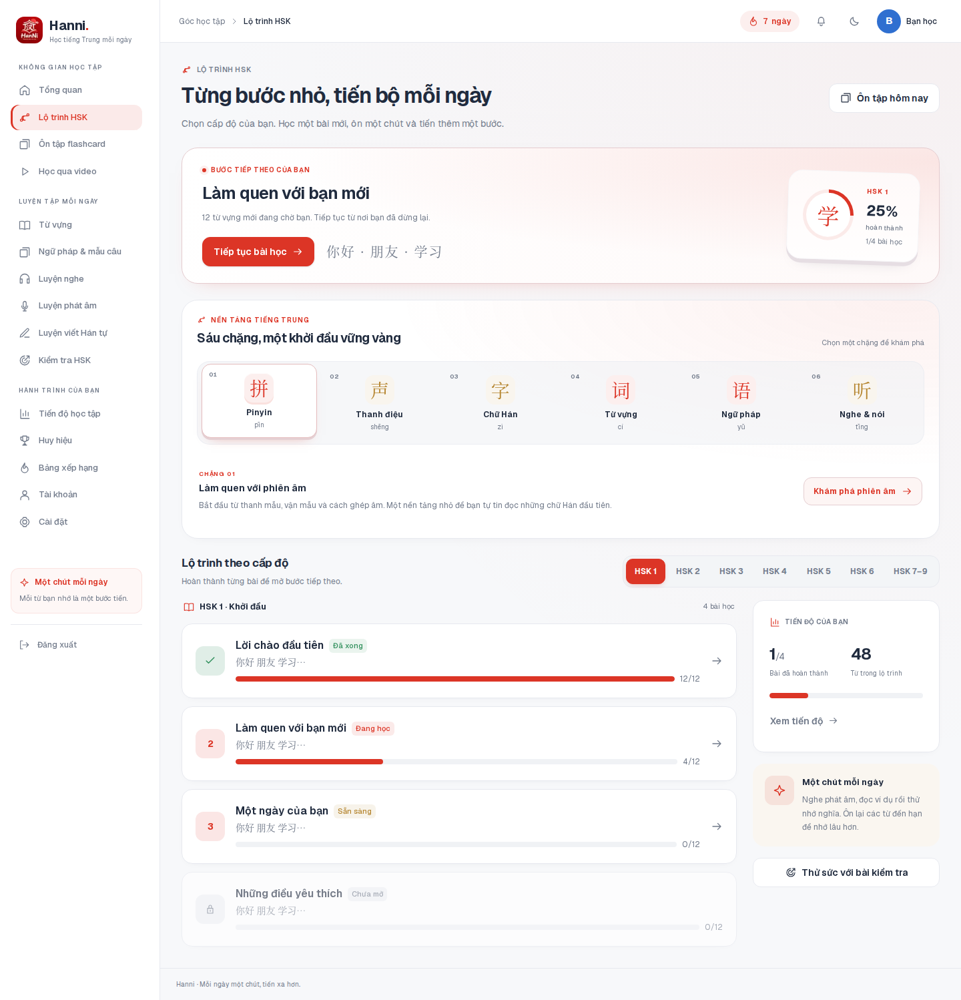
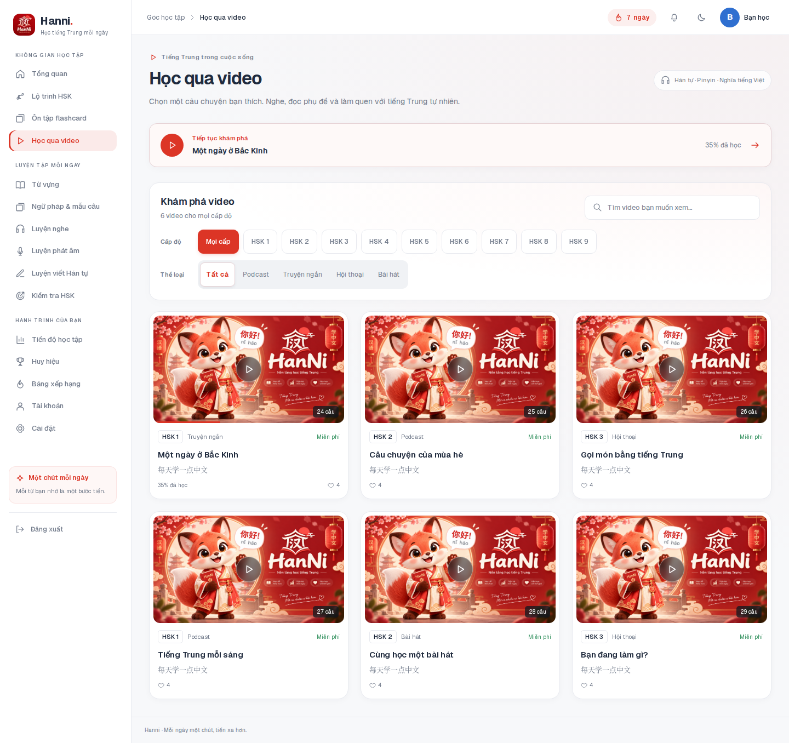
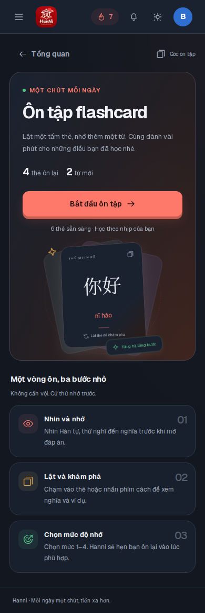

# Cải thiện trải nghiệm học tập

## Thay đổi giao diện

- **Ôn tập flashcard:** mở rộng bố cục, đưa nút bắt đầu và số thẻ lên cùng một vùng, minh họa chồng thẻ có chiều sâu bằng CSS. Khi học, thẻ lật 3D, có tiến độ bên cạnh và bốn mức đánh giá cố định để tránh nhảy bố cục. Mặt thẻ ẩn không nhận focus; giữ phím cách và phím 1–4.
- **Lộ trình HSK:** đưa bài học tiếp theo lên đầu. Sáu chặng nền tảng thành bộ tab gọn với một vùng chi tiết; hỗ trợ phím mũi tên, Home, End. Giữ danh sách khi đổi cấp, đồng thời chặn thao tác vào bài của cấp cũ trong lúc tải.
- **Thư viện video:** gom tìm kiếm và bộ lọc vào cùng thanh công cụ. Nền chọn trượt theo tab, danh sách cũ tiếp tục hiển thị khi tải hoặc khi tải lỗi, có nút thử lại. Thẻ video nâng nhẹ và phóng ảnh khi rê chuột.
- **Thành phần chung:** thu gọn tiêu đề, làm mảnh thanh cuộn sidebar, mở rộng vùng nội dung trên màn hình lớn. Chuyển cảnh chỉ áp dụng cho nội dung trang; sidebar và header giữ ổn định. Thư viện từ vựng, ngữ pháp và màn chuẩn bị luyện tập dùng chung bộ lọc, nhịp khoảng cách và tiêu đề.
- **Khả năng tiếp cận:** hỗ trợ giao diện tối, màn hình nhỏ và `prefers-reduced-motion`. Bộ chọn HSK 3D trên trang chủ chuyển theo thao tác của người dùng, không tự đổi thẻ khi đang đọc.

## Nguồn tham khảo và cách áp dụng

| Nguồn | Áp dụng trong Hanni |
| --- | --- |
| [Material Design — Material motion](https://m1.material.io/motion/material-motion.html) | Chuyển động dẫn mắt đến trạng thái vừa thay đổi; thời lượng ngắn, đồng bộ giữa các bộ lọc. |
| [Nielsen Norman Group — Tabs, Used Right](https://www.nngroup.com/articles/tabs-used-right/) | Trạng thái chọn rõ ràng, vùng nội dung nhất quán; phân biệt tab nội dung với nút lọc và liên kết điều hướng. |
| [Duolingo — New home screen design](https://blog.duolingo.com/new-duolingo-home-screen-design/) | Làm rõ bước học tiếp theo và đưa thao tác tiếp tục học lên trước danh sách. |
| [web.dev — High-performance CSS animations](https://web.dev/articles/animations-guide) | Ưu tiên `transform` và `opacity` cho chuyển cảnh, lật thẻ và hover; không thêm thư viện animation. |
| [W3C — C39: prefers-reduced-motion](https://www.w3.org/WAI/WCAG22/Techniques/css/C39) | Tắt chuyển động khi người dùng chọn giảm hiệu ứng. |
| [SWR — Understanding SWR](https://swr.vercel.app/docs/advanced/understanding) | Dùng `keepPreviousData` cho video và lộ trình để giảm nhấp nháy khi đổi bộ lọc. |

Đã đọc hướng dẫn Next.js đi kèm phiên bản đang cài: `template.js`, Server and Client Components và CSS trong `node_modules/next/dist/docs/`. Mã và minh họa CSS được viết riêng cho Hanni; giữ API và cơ chế xác thực hiện có.

## Kiểm tra

- `npm run build`: thành công, gồm TypeScript và tạo các trang production.
- `npm run lint`: không lỗi; còn 5 cảnh báo `set-state-in-effect` có sẵn ở các tệp ngoài phạm vi sửa.
- `npm run test:pwa`: 12/12 kiểm tra đạt.
- Chromium trên bản production: ba trang `/study`, `/learn`, `/watch` không tràn ngang tại 320, 390, 768, 1440 và 1920px; kiểm tra thêm giao diện tối và giảm chuyển động.
- Lọc video chậm, kết quả rỗng, lỗi và thử lại; nền chọn bám đúng vị trí nút sau khi thay đổi kích thước.
- Lật và đánh giá sáu thẻ bằng bàn phím; lỗi lưu giữ nguyên thẻ để thử lại, bấm nhanh không gửi trùng.
- Điều khiển chặng HSK bằng bàn phím, giữ tab khi tải cấp mới, sidebar không bị tạo lại khi chuyển trang; menu mobile mở/đóng bằng Escape và trả focus về nút mở.
- Kiểm tra hiển thị năm màn dùng thành phần chung: từ vựng, ngữ pháp, kiểm tra HSK, luyện nghe và luyện phát âm; vào bài luyện rồi quay lại phần chọn bài. Bộ chọn HSK trên trang chủ giữ nguyên cấp đã chọn khi người dùng đang đọc.

Các kiểm tra trình duyệt dùng API giả lập trong môi trường kiểm tra để tái hiện dữ liệu và lỗi có kiểm soát; không thay thế kiểm tra tích hợp với backend thật. Không thêm dữ liệu giả vào ứng dụng.

## Ảnh xem trước

Ảnh chụp bản production với dữ liệu kiểm tra; hình thu nhỏ video dùng ảnh thương hiệu cục bộ.

