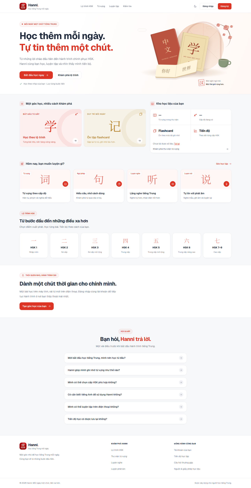
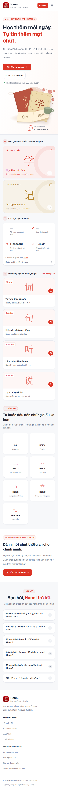
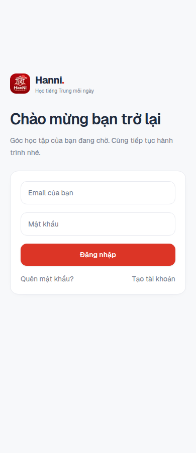

# Giao diện Hanni

Giao diện tham khảo bố cục [Hanbeego](https://hanbeego.com/) và ảnh thiết kế người dùng cung cấp, điều chỉnh theo nghiệp vụ Hanni. Tông đỏ, trắng và xám nhạt; hỗ trợ giao diện tối và điện thoại. Không bổ sung mock data, seed hay backend.

## Màn hình và dữ liệu

| Đường dẫn | Chức năng | Dữ liệu hiện có |
| --- | --- | --- |
| `/` | Giới thiệu, kho học liệu, chọn kỹ năng/HSK, hỏi đáp | Số từ và cấp độ từ `/levels`; nội dung giới thiệu là nội dung tĩnh |
| `/dashboard` | Tổng quan, mục tiêu, chuỗi ngày, lối tắt luyện tập | Study stats, streak, progress, levels |
| `/learn?level=…` | Lộ trình theo cấp | `/learn/path` |
| `/learn/[lessonId]` | Từ vựng, ví dụ, nghe và ẩn nghĩa; bắt đầu học | `/learn/lessons/:id` |
| `/study?lesson=…` | Flashcard và kiểm tra cuối buổi | Study session, queue, review và quiz |
| `/vocabulary` | Tìm kiếm, lọc HSK, nghe từ | `/words` |
| `/grammar` | Khám phá cách dùng từ qua câu ví dụ, pinyin, ẩn/hiện bản dịch | `Word.examples` trong `/words` |
| `/listening` | Nghe rồi nhập Hán tự, đối chiếu và gợi ý | Từ và `audioUrl` trong `/words` |
| `/pronunciation` | Nghe mẫu, ghi âm tối đa 45 giây, nghe lại và tải bản ghi | Từ/audio thật; micro trên thiết bị |
| `/exams` | Kiểm tra từ vựng HSK 5 hoặc 10 câu | `/levels`, `/words`, `/quiz/generate`, `/quiz/submit` |
| `/exams/results` | Điểm server và xem lại đáp án | Kết quả submit đã xác nhận, giữ trong `sessionStorage` theo tài khoản và lượt làm |
| `/progress`, `/achievements` | Tiến độ và huy hiệu có thật | Progress overview, achievements |
| `/account`, `/settings` | Hồ sơ, bảo mật, mục tiêu, cách ôn, múi giờ | User và settings, giữ nguyên các PATCH hiện có |

Mọi yêu cầu API vẫn dùng `lib/api.ts`, cookie phiên và cơ chế refresh token có sẵn. Lựa chọn bài/cấp HSK được giữ qua `next` khi đăng nhập hoặc chuyển sang đăng ký. Chỉ chấp nhận đường dẫn nội bộ. Chuyển bài trong `/study` khởi tạo buổi học đúng bài mới. Đăng xuất dọn cache SWR và kết quả xem lại trên thiết bị.

## Phạm vi chức năng đang hỗ trợ

- Chưa có API video: trang chủ giới thiệu các cách học sẵn có, không dựng danh sách video hay số lượt xem.
- Ngữ pháp sử dụng câu ví dụ đi kèm từ. Không có bộ bài giảng/quy tắc ngữ pháp riêng; nhóm chưa có ví dụ hiển thị trạng thái trống.
- Luyện nghe đối chiếu Hán tự trên client, số câu đúng chỉ thuộc phiên đang mở; không tự ghi vào tiến độ ôn tập.
- Phát âm ghi âm và nghe lại trên thiết bị, không gửi bản ghi lên server và không tạo điểm phát âm AI. Chuyển từ/trang sẽ dừng micro và giải phóng bản ghi. Ghi âm cần HTTPS hoặc localhost cùng quyền micro.
- Nếu thiếu bản thu, các màn luyện tập có thể dùng giọng tiếng Trung phổ thông của trình duyệt; hiển thị rõ nguồn giọng và thông báo khi thiết bị không hỗ trợ.
- Kiểm tra là quiz từ vựng, không phải đề thi HSK đầy đủ. Tạo câu hỏi từ nhóm tối đa 24 từ của cấp đang chọn do API danh sách hiện tại cung cấp. Chỉ hoàn tất khi `/quiz/submit` trả điểm hợp lệ; nộp lỗi giữ đáp án để thử lại.
- Chưa có endpoint lịch sử nên trang kết quả chỉ xem lại trong tab hiện tại, không giả lịch sử từ server. Chưa có API gói học/thanh toán nên tài khoản chỉ trình bày hồ sơ và cài đặt thật.

## Thương hiệu và hình ảnh

Logo thương hiệu chính thức lấy từ file `app/favicon.ico` được cập nhật trên `main` tại commit `dc2d5e1`. File nguồn thực chất là PNG 1254 × 1254 được đặt đuôi `.ico`: bản PNG gốc được giữ nguyên tại `public/brand/hanni.png`, còn `app/favicon.ico` đã được chuyển thành ICO đúng định dạng với các kích thước 16, 32, 48, 64, 128 và 256px. `Brand` dùng bản PNG qua Next Image cho header, sidebar và màn đăng nhập; icon Hán tự tạm `app/icon.svg` đã được bỏ để trình duyệt chỉ nhận favicon chính thức.

Xung đột merge là `modify/delete` ở `app/favicon.ico`: giữ logo mới từ `main` khi hợp nhất nhánh giao diện. Đã kiểm tra build production, logo trên trang chủ desktop/mobile và đăng nhập; favicon được phục vụ dưới MIME ảnh ICO với header hợp lệ.

Minh họa sách ở trang chủ dựng trực tiếp bằng CSS trong `components/study-artwork.tsx`; không tải ảnh hay tài nguyên thương hiệu bên thứ ba. Các ký tự trang trí không phải bản ghi học liệu.

## Hiệu ứng và thành phần chung

- `app/globals.css`: token light/dark, panel, hover, focus, skeleton và minh họa.
- `components/page-motion.tsx` + `app/template.tsx`: mờ hiện trang và reveal nội dung, kể cả dữ liệu nạp sau. Reveal 620ms, dịch 16px, trễ theo nhóm tối đa 320ms.
- Hover 260ms; thẻ nâng 4px, nút nâng 2px và mũi tên dịch nhẹ. Chỉ áp dụng hover nâng trên thiết bị có con trỏ phù hợp.
- Tôn trọng `prefers-reduced-motion`, không trì hoãn API để chạy hiệu ứng. Nội dung vẫn hiện khi JavaScript/IntersectionObserver không hỗ trợ và khi in.
- `loading.tsx` trong hai nhóm route dùng skeleton. Có màn 404 và lỗi tải đồng bộ giao diện.
- `components/app-shell.tsx`: sidebar, breadcrumbs, tài khoản; menu mobile dùng dialog gốc, giữ focus và hỗ trợ Escape.
- `components/theme-toggle.tsx`: đồng bộ trạng thái các nút sáng/tối.
- Âm thanh dừng và micro được giải phóng khi rời nội dung.

## Kiểm tra ngày 10/09/2026

- `npm run build`: thành công, bao gồm TypeScript và tạo route production.
- `npm run lint`: không lỗi; hai cảnh báo `set-state-in-effect` còn lại ở auth context và trang xác minh email có sẵn.
- `git diff --check`: đạt.
- Chrome/Playwright chạy trên bản production, không mock API: trang chủ tại 320, 390, 768, 1440px không tràn ngang; FAQ mở/đóng, menu mobile, đăng nhập/đăng ký giữ cấp HSK, chuyển hướng bảo vệ các route mới và trang 404 đều đạt; không có lỗi JavaScript.
- Chrome: hover nâng thẻ, giảm chuyển động, đồng bộ theme giữa menu desktop/mobile và favicon đều đạt.
- Kiểm tra helper điều hướng với 16 trường hợp đường dẫn nội bộ, URL ngoài và vòng lặp auth: đạt.
- Backend mặc định `http://localhost:8000/api` không chạy tại thời điểm kiểm tra; chưa có tài khoản/URL backend khác. Vì vậy chưa xác nhận end-to-end dữ liệu đăng nhập, lưu bài học, quiz, cài đặt hay nội dung các trang riêng tư với server thật. Không bỏ qua xác thực để tạo ảnh mẫu.

## Ảnh xem trước

Ảnh trang công khai chụp thật khi backend chưa chạy; số liệu thiếu hiển thị “—” và nút tải lại. Logo đã được cập nhật theo file thương hiệu trên `main`.

