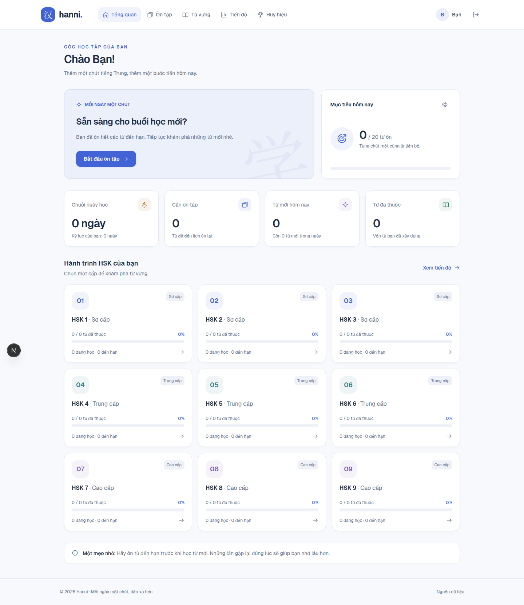

# Giao diện Hanni

Bản thiết kế riêng cho nghiệp vụ Hanni, dùng nền trắng/xám rất nhạt, điểm nhấn xanh và màu trạng thái nhẹ. Không sao chép giao diện hoặc luồng nghiệp vụ từ `chinese-learning-app`.

## Phạm vi

- Chỉ cải thiện giao diện và tương tác phía client. Không thêm bộ từ vựng, seed dữ liệu, backend hay thuật toán học.
- Giữ các endpoint và cấu trúc request hiện có. Các trang riêng tư vẫn cần đăng nhập như trước.
- Thẻ “你好” ở trang chủ là minh họa tương tác, không được lưu vào thư viện hay tiến độ.
- Các trạng thái trống, tải và lỗi giúp trang vẫn rõ ràng khi chưa có dữ liệu. Không dùng số liệu giả để thay thế phản hồi API trong ứng dụng.

## Các phần để kiểm soát

| Commit | Thay đổi |
| --- | --- |
| `c44255b` | Màu sắc, thành phần UI dùng chung, điều hướng desktop/mobile, focus bàn phím và liên kết bỏ qua menu. |
| `08817b1` | Trang chủ, thẻ minh họa, tổng quan ưu tiên hành động học, mục tiêu ngày và thẻ cấp HSK. |
| `c5d8cee` | Thư viện từ vựng, flashcard, quiz, tiến độ, huy hiệu, cài đặt; trạng thái trống/lỗi, khóa nút khi đang lưu đánh giá. |
| `5282960` | Bố cục đăng nhập/đăng ký, nhãn truy cập cho ô nhập; ẩn Google khi chưa cấu hình và bỏ thông báo kỹ thuật khỏi màn người dùng. |

## Chỗ chỉnh giao diện

- `app/globals.css`: toàn bộ token màu, nền, viền, typography và lớp dùng chung.
- `components/ui.tsx`: nút, thẻ, tiêu đề trang, tiến độ, thống kê, thông báo lỗi và trạng thái trống.
- `components/nav.tsx`: thương hiệu và menu theo trạng thái đăng nhập.
- `components/auth-shell.tsx`: khung màn đăng nhập/đăng ký.
- `components/flashcard.tsx`: bố cục thẻ và các mức đánh giá; phím cách lật thẻ, phím 1–4 đánh giá khi không focus vào nút/ô nhập.
- Các file `app/*/page.tsx`: bố cục từng màn hình.

## Xem trước

Chạy `npm ci`, sau đó `npm run dev`. Trang chủ và màn đăng nhập có thể xem khi chưa chạy backend. Các trang riêng tư cần `hanni-server` cùng tài khoản hợp lệ; không có chế độ bỏ qua đăng nhập.

Ảnh tổng quan bên dưới được chụp bằng phản hồi API giả lập trong trình duyệt kiểm thử, với tiến độ bằng 0. Các fixture không nằm trong ứng dụng và không ghi dữ liệu vào backend.

### Trang chủ

### Tổng quan

### Đăng nhập trên điện thoại

## Kiểm tra

- `npm run build`: thành công.
- `npm run lint`: không có lỗi; còn 4 cảnh báo `set-state-in-effect` từ các pattern có sẵn ở xác minh email, cài đặt và auth context.
- Chromium/Playwright: kiểm tra bố cục tại 320, 390, 768 và 1440px; không tràn ngang ở các màn đã kiểm tra.
- Kiểm tra lật thẻ minh họa, liên kết chọn HSK, tìm kiếm, trạng thái trống/lỗi/thử lại, menu mobile, flashcard bàn phím/chạm, chọn đáp án và hoàn tất quiz.
- Các kiểm tra tương tác dùng mock API ngoài repository. Chưa xác nhận tích hợp với backend thật trong đợt chỉnh giao diện này.

## Hiệu ứng vào trang và hover

Hiệu ứng tham khảo CSS trong `../index.html`, giữ bảng màu sáng của Hanni.

- Vào trang: mờ hiện trong 600ms; header xuất hiện nhẹ trong 1000ms.
- Khối nội dung hiện khi cuộn vào màn hình: 1200ms, dịch lên 26px (18px trên mobile), lệch nhau 80ms và tối đa 320ms cho mỗi nhóm.
- Hover: chuyển tiếp 420ms, thẻ nâng 5px và tăng bóng/viền; nút nâng 3px, mũi tên dịch nhẹ. Nhấn nút thu nhẹ trong 160ms.
- Hiệu ứng áp dụng cố định, không phụ thuộc cài đặt giảm chuyển động của hệ điều hành, theo yêu cầu thiết kế.
- Reveal chạy một lần mỗi lần vào trang và hỗ trợ nội dung được nạp sau. Tab vào phần tử sẽ hiện ngay; không thêm thời gian chờ vào API.
- `app/template.tsx` khởi động hiệu ứng khi đổi trang; `components/page-motion.tsx` quản lý observer và dọn dẹp khi rời trang. Header và auth context vẫn giữ nguyên giữa các trang.
- Chỉnh nhịp bằng `--reveal-duration`, `--reveal-distance`, `--motion-ease`, `--hover-duration` trong `app/globals.css`. Thêm class `reveal` vào khối, `reveal-group` vào nhóm cần hiện lần lượt, `hover-card` hoặc `motion-button` cho hover.
- Nội dung vẫn hiển thị khi JavaScript/IntersectionObserver không khả dụng; bản in không giữ trạng thái ẩn của reveal.

Kiểm tra hiệu ứng bằng Chromium: thời lượng và độ trễ, reveal khi cuộn, hover nâng thẻ, chuyển trang, nội dung API nạp sau, focus bàn phím, mobile, JavaScript tắt và bản in đều đạt. Đã xác nhận hiệu ứng vẫn chạy khi hệ điều hành bật giảm chuyển động theo yêu cầu.
