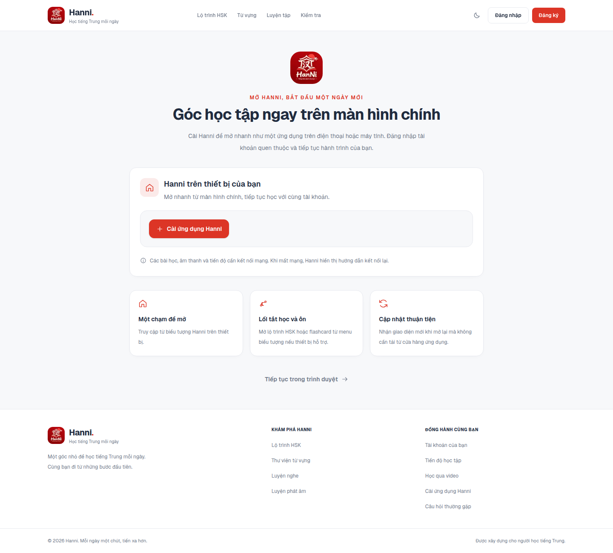
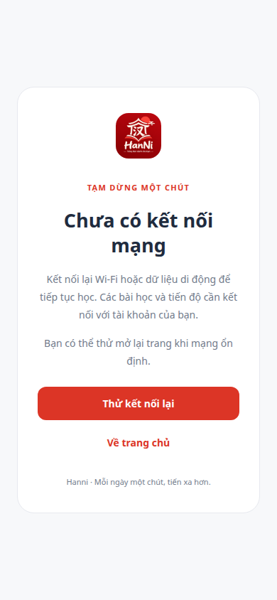

# PWA Hanni

Triển khai phía client dựa trên các phần PWA đã đọc ở dự án `../lingora`: manifest, runtime đăng ký service worker, lời mời cài ứng dụng và thẻ cài đặt. Trong workspace không có thư mục `lingoda`; nguồn đối chiếu là `lingora`. Quy ước tích hợp theo tài liệu PWA trong `node_modules/next/dist/docs/` của bản Next.js đang cài.

## Phạm vi hiện có

| Phần | Hành vi trong Hanni |
| --- | --- |
| Nhận diện | Manifest tiếng Việt, màu thương hiệu, chế độ standalone, mở `/dashboard` qua luồng xác thực hiện có. |
| Biểu tượng | PNG 192, 512, maskable 512 và Apple Touch 180 tạo từ logo gốc `public/brand/hanni.png`; favicon hiện có được giữ. |
| Lối tắt | Lộ trình `/learn` và ôn tập `/study` khi thiết bị hỗ trợ. |
| Cài đặt | Trang công khai `/install`, liên kết ở footer, thẻ cài trong `/settings`. Chỉ gọi lời mời cài từ sự kiện thật của trình duyệt khi người dùng bấm nút. |
| Popup mời cài | `components/pwa/install-prompt.tsx` — thẻ nổi ở góc phải dưới trong khu vực đã đăng nhập (`app/(app)/layout.tsx`). Chỉ hiện khi trình duyệt phát `beforeinstallprompt` (hoặc iOS Safari). Người dùng bấm **Để sau**/đóng thì tạm ẩn 7 ngày (`localStorage: hanni-pwa-prompt-dismissed`). Ở `npm run dev` hiện bản xem thử để canh giao diện; nút cài thật chỉ chạy ở bản production. |
| iPhone/iPad | Hướng dẫn cài qua Safari; trình duyệt khác không cung cấp lời mời thì hướng dẫn dùng menu. |
| Mất mạng | Thông báo ở trang đang mở; khi tải một trang mới mà mạng lỗi, trả màn hướng dẫn thử lại tại chính URL đó. |
| Cập nhật | Worker mới chờ kích hoạt; thẻ cài hiển thị nút cập nhật. Chỉ tab bấm nút tải lại, các tab khác giữ nguyên trang. |
| Thông báo đẩy | Thẻ `components/pwa/notification-card.tsx` trong `/settings` — chỉ hiện khi worker đã `ready` và trình duyệt hỗ trợ Push API. Bấm **Bật thông báo** xin quyền, đăng ký `PushManager` bằng khóa VAPID lấy từ `GET /push/public-key`, rồi lưu subscription qua `POST /push/subscribe`. Có nút **Gửi thử** (`POST /push/test`) và **Tắt thông báo** (huỷ ở trình duyệt + `DELETE /push/subscribe`). |

Không thêm thư viện phụ thuộc hoặc dữ liệu học tập giả. Phần lưu đăng ký push, khóa VAPID và gửi thông báo (tương ứng backend riêng trong Lingora) **đã chuyển sang Hanni** — xem bảng trên và `hanni-server` (`src/modules/push`). Lịch nhắc học tự động theo giờ ôn tập vẫn CHƯA làm — hiện chỉ có gửi thủ công (nút "Gửi thử") qua API, chưa có scheduler nhắc hằng ngày.

## Cache và kết nối

Service worker `public/sw.js` chỉ lưu bốn tài nguyên công khai trong `hanni-public-v1`:

- `/offline/index.html`
- `/offline/offline.css`
- `/offline/offline.js`
- `/icons/icon-192.png`

Điều hướng trang dùng mạng, chỉ trả fallback khi yêu cầu mạng thất bại. Phản hồi HTTP như 401/500 được giữ nguyên. Worker không ghi trang cá nhân vào Cache Storage, không can thiệp API, POST, RSC, chunk Next.js hay yêu cầu khác origin. Video đăng nhập và audio bài học không được lưu bởi worker. Khi kích hoạt, chỉ xóa cache cũ có tiền tố `hanni-public-`.

Đây là màn hỗ trợ kết nối lại, chưa phải chức năng học offline. Cần mở ứng dụng online ít nhất một lần và chờ worker cài thành công trước khi có fallback. Việc chuyển trang bên trong ứng dụng qua RSC vẫn cần mạng. `navigator.onLine` chỉ phản ánh kết nối thiết bị, không khẳng định backend hoạt động; lỗi backend tiếp tục do các màn hiện có xử lý.

## Chạy và triển khai

```bash
npm run test:pwa
npm run lint
npm run build
npm start
```

Mở `http://localhost:3000/install` để kiểm tra local. Bản triển khai cần HTTPS và phục vụ ứng dụng tại gốc tên miền vì manifest, worker và các tài nguyên dùng đường dẫn tuyệt đối từ `/`. Không đăng ký worker mới trong `npm run dev`; worker đã cài trước đó trên cùng origin vẫn tồn tại, nên dùng cổng riêng hoặc xóa đăng ký của origin thử nghiệm trong DevTools nếu chuyển qua lại giữa dev và production.

Giữ `/sw.js`, `/manifest.webmanifest`, `/icons/*` và `/offline/*` truy cập công khai. Proxy/CDN cần giữ header của `/sw.js` trong `next.config.ts`: JavaScript đúng MIME, không cache, scope `/`. Không chuyển các đường dẫn này về trang đăng nhập.

Khi sửa tài nguyên offline, tăng hậu tố `CACHE_NAME` trong `public/sw.js`, ví dụ `v1` thành `v2`. Mỗi lần cần phát hành bản worker mới cũng phải thay nội dung file này để trình duyệt phát hiện. Giao diện Next.js không nằm trong cache của worker, nên bản chỉ đổi giao diện không tự tạo thông báo cập nhật worker; tải lại trang sẽ nhận bản giao diện mới từ server.

Runtime kiểm tra worker lúc đăng ký và khi quay lại tab có mạng. Worker mới không gọi `skipWaiting` trong bước cài; người dùng hoàn tất bài, lưu thay đổi rồi bấm **Cập nhật và mở lại** trong thẻ cài. Nếu chưa bấm, worker có thể tự kích hoạt theo vòng đời trình duyệt khi mọi tab dùng bản cũ đã đóng. Không có thao tác tải lại bắt buộc trên các tab khác.

## Kiểm tra đã thực hiện

- `npm run test:pwa`: đạt 12/12; kiểm tra phạm vi cache, API/POST/RSC, lỗi xác thực, offline fallback, kích hoạt, thông điệp cập nhật, và hiển thị/điều hướng thông báo đẩy (`push`, `notificationclick`).
- `npm run build`: thành công, gồm kiểm tra TypeScript và tạo các route `/install`, `/manifest.webmanifest`.
- `npm run lint`: 0 lỗi; còn 3 cảnh báo có sẵn ở trang xác minh email, avatar và auth context.
- Chrome chạy bản production local với hồ sơ riêng: không có lỗi installability; manifest và icon trả 200, lời mời cài thật xuất hiện, header worker đúng.
- Màn rộng và viewport 390 px: trang cài và màn offline không tràn ngang. Khi offline, API lỗi mạng, tải `/account` trả fallback với logo đầy đủ; bật mạng và bấm thử lại đi về đăng nhập theo luồng xác thực.
- Kiểm tra bản worker mới với hai tab: không tự tải lại khi phát hiện cập nhật; tab bấm cập nhật tải lại; nội dung email đang nhập ở tab đăng nhập giữ nguyên.

Chưa kiểm tra cài lên màn hình chính của iPhone/Android thật hoặc phiên học có backend. Kiểm tra Chrome ở trên xác nhận điều kiện cài và lời mời cài, chưa thực hiện cài ứng dụng vào hệ điều hành. Bài kiểm tra worker dùng mô phỏng API trình duyệt trong bộ kiểm thử, không đưa mock data vào ứng dụng. Tương tự, thẻ thông báo đẩy mới thêm đã kiểm tra qua API backend (đăng ký/gửi thử/huỷ qua `curl`) và test đơn vị cho `push`/`notificationclick` trong `sw.js`, nhưng CHƯA xin quyền thông báo thật và nhận push trên trình duyệt/thiết bị thật — cần người dùng bấm **Bật thông báo** ở `/settings` trên bản production rồi thử **Gửi thử** để xác nhận notification thật sự hiện ra.

Để kiểm tra thủ công: mở `/install` ở bản production, xem Application → Manifest và Service Workers trong DevTools; chuyển Network sang Offline rồi tải lại một URL nội bộ. Bật mạng, bấm **Thử kết nối lại**. Với cập nhật, mở hai tab, thay phiên bản worker và bấm Update trong DevTools của môi trường thử nghiệm; nút cập nhật xuất hiện trong thẻ cài. Kiểm tra tab còn lại giữ nội dung đang nhập.

## Commit triển khai

| Commit | Nội dung |
| --- | --- |
| `163e699` | Thêm manifest và bộ biểu tượng cài đặt PWA cho Hanni. |
| `d57b67f` | Thêm service worker, trạng thái kết nối, màn mất mạng và kiểm thử. |
| `9a5be68` | Thêm trang cài, thẻ trong Cài đặt và cập nhật chủ động. |

## Ảnh kiểm tra trên trình duyệt




